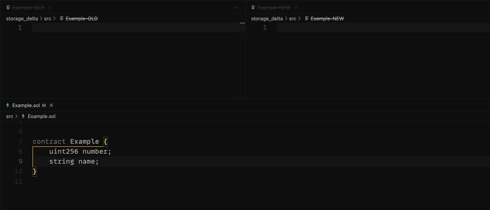

# ⟁ Storage Delta &nbsp;&nbsp;

Storage Delta is a tool for inspecting storage layout changes between contract upgrades.



## Install

To install with [Foundry](https://github.com/foundry-rs/foundry):

```bash
forge install 0xPolygon/storage-delta
```

## Usage

Storage Delta compares the entire suite to any previous version.

```bash
bash lib/storage-delta/run.sh <COMMIT_OR_TAG>
```

`./storage_delta` will be generated if there are findings. Open `OLD` and `NEW` files side by side for best experience.

## Findings

|     | Finding                                    |
| --- | ------------------------------------------ |
| 🏴   | [Problematic](#problematic)                |
| 🏳️   | [Moved](#moved)                            |
| 🏁   | [Moved & problematic](#moved--problematic) |
| 🪦   | [Removed](#removed)                        |
| 🌱   | [New](#new)                                |


### New

**Emoji:** 🌱

**Description:**

When a variable with a unique name and type is added.

**Example:**

```solidity
uint256 a;
```

```solidity
uint256 a;
bool b;
```

---

### Problematic

**Emoji:** 🏴

**Description:**

When a new variable is added, but it conflicts with the existing storage.

**Example:**

```solidity
uint256 a;
```

```solidity
bool b;
```

---

### Moved

**Emoji:** 🏳️

**Description:**

When an existing variable is moved.

**Example:**

```solidity
uint256 a;
// ...
```

```solidity
// ...
uint256 a;
```

---

### Moved & problematic

**Emoji:** 🏁

**Description:**

When an existing variable is moved and conflicts with the existing storage.

**Example:**

```solidity
uint256 a;
bool b;
```

```solidity
bool b;
uint256 a;
```

---

### Removed

**Emoji:** 🪦

**Description:**

When a variable no longer exists.

**Example:**

```solidity
uint256 a;
bool b;
```

```solidity
uint256 a;
```

---

## Requirements

Files should be named after the contract they hold. `Example` → `Example.sol`

The script utilizes Node.js to run. We recommend the node version defined in the `.nvmrc` file.

## License

​
Licensed under either of
​

- Apache License, Version 2.0, ([LICENSE-APACHE](LICENSE-APACHE) or http://www.apache.org/licenses/LICENSE-2.0)
- MIT license ([LICENSE-MIT](LICENSE-MIT) or http://opensource.org/licenses/MIT)
  ​

at your option.

Unless you explicitly state otherwise, any contribution intentionally submitted for inclusion in the work by you, as defined in the Apache-2.0 license, shall be dual licensed as above, without any additional terms or conditions.

---

© 2023 PT Services DMCC
